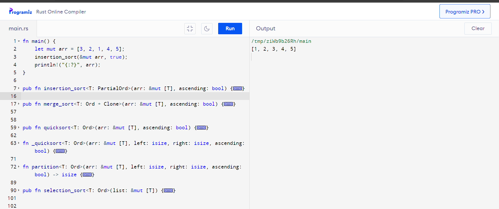
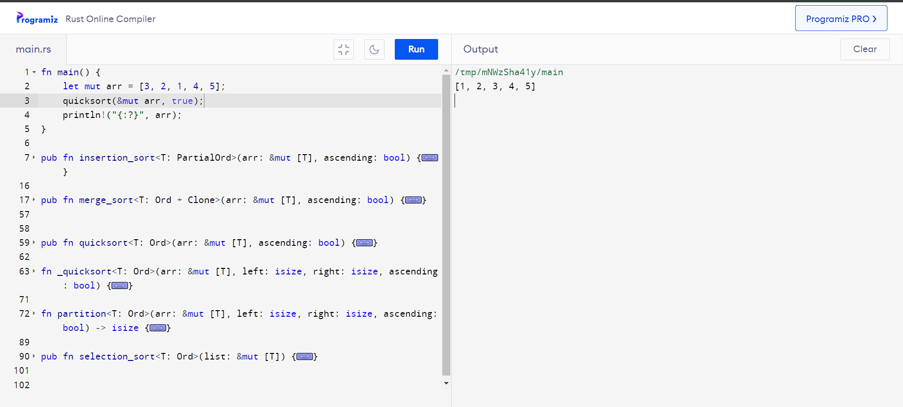

# Sorting Library

To use this sorting library, simply include it as a dependency in your Rust project's `Cargo.toml`:

```toml
[dependencies]
sorting_library = { git = "https://github.com/Narimannmn/Sorting_library.git", branch = "main" }

Then, import the library into your Rust code:
use sorting_library::{insertion_sort, merge_sort, quicksort, selection_sort};
You can then call any of the sorting functions provided by the library, passing in the list of objects to be sorted and the comparison operator.


## Usage
You can then call any of the sorting functions provided by the library, passing in the list of objects to be sorted and the comparison operator.

fn main() {
    let mut arr = [3, 2, 1, 4, 5];
    insertion_sort(&mut arr, true); 
    println!("{:?}", arr);
}//ascenduing order


fn main() {
    let mut arr = [3, 2, 1, 4, 5];
    merge_sort(&mut arr, false);
    println!("{:?}", arr); 

}//descending order


fn main() {
    let mut arr = [3, 2, 1, 4, 5];
    quicksort(&mut arr, true); // Ascending order
    println!("{:?}", arr); // [1, 2, 3, 4, 5]
}


fn main() {
    let mut arr = [3, 2, 1, 4, 5];
    selection_sort(&mut arr);
    println!("{:?}", arr);
}


Copyright (c) Nariman Aimagambetov SE-2208 Blockchain 2
